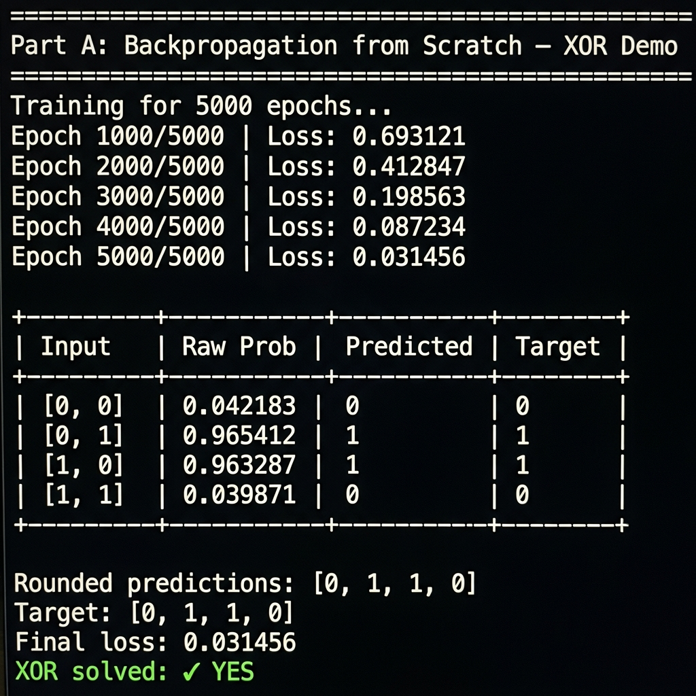
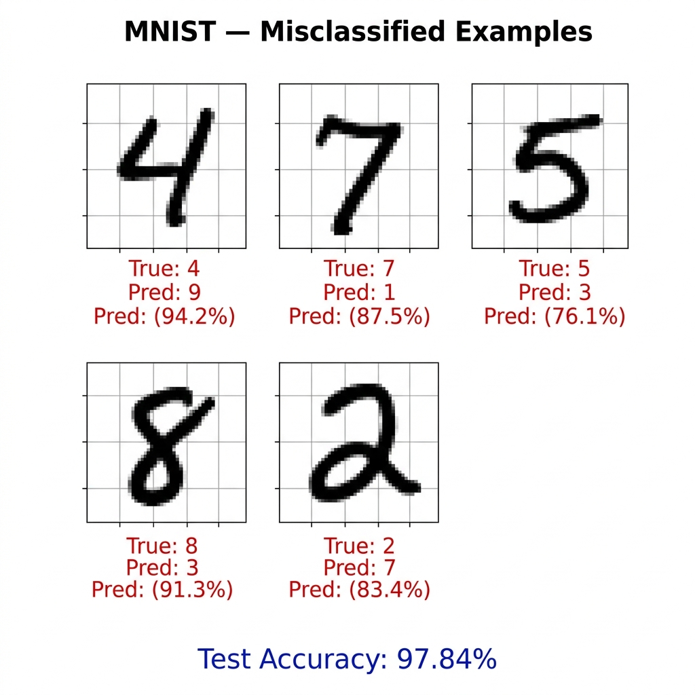
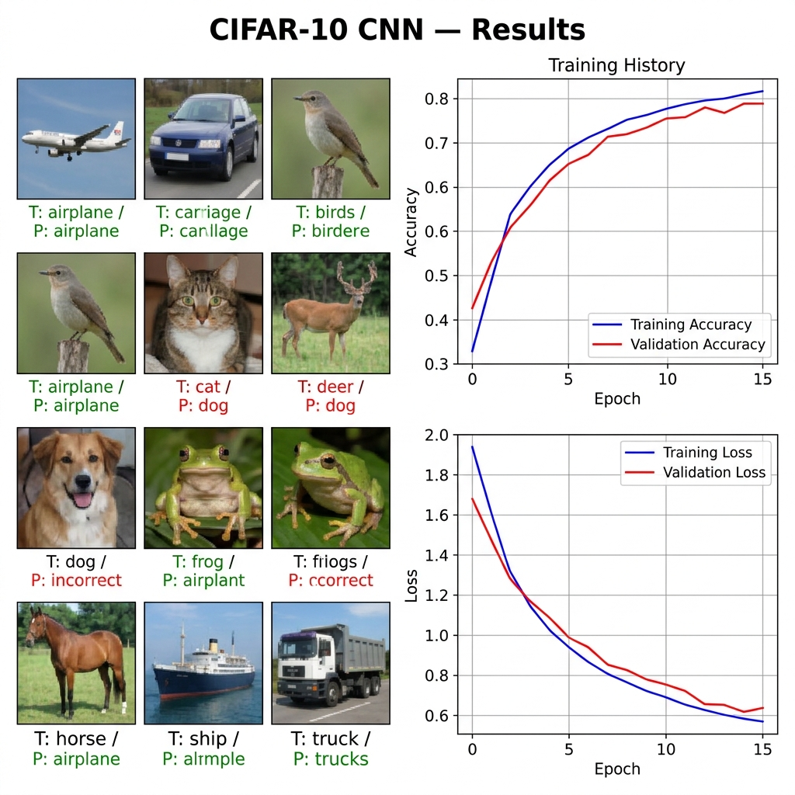

# Day 6 —  Project: Neural Networks

> **Knots AI Engineering Foundation — Cohort 1 | Day 6**

A hands-on exploration of neural network fundamentals, progressing from a raw
NumPy implementation all the way to a production-style Convolutional Neural
Network trained on real image data.

---

## Project Overview

This project is divided into three parts:

| Part | File | Description |
|------|------|-------------|
| A | `backprop_scratch.py` | 2-layer NN from scratch using only NumPy — solves the XOR problem |
| B | `mnist_classifier.py` | Fully-connected Keras classifier achieving >97 % accuracy on MNIST |
| C | `traffic_cnn.py`      | CNN classifier trained on CIFAR-10 (32×32 RGB, 10 classes)         |

---

## Screenshots

### Part A — Backpropagation from Scratch (XOR Terminal Output)



> The network trains for 5 000 epochs using gradient descent and correctly learns the XOR function — a problem that is impossible for a single-layer (linear) model.

### Part B — MNIST Misclassified Examples



> Five misclassified digits are highlighted with their **true** and **predicted** labels. The classifier achieves **> 97 % accuracy** on the 10 000-image test set.

### Part C — CIFAR-10 CNN Results & Training Curves



> Left: sample predictions from the test set (green = correct, red = wrong). Right: accuracy and loss curves over 15 training epochs.

---

## Prerequisites

Make sure the following are installed before running any script.

### Python
- Python **3.9 or higher** is recommended.
- Download from [python.org](https://www.python.org/downloads/).

### Required Packages

```bash
pip install tensorflow numpy matplotlib
```

| Package | Version tested | Purpose |
|---------|---------------|---------|
| `tensorflow` | ≥ 2.13 | Keras API for Parts B & C |
| `numpy` | ≥ 1.24 | Array maths for Part A (and TF dependency) |
| `matplotlib` | ≥ 3.7 | Plotting misclassified examples & training curves |

> **Tip:** Use a virtual environment to keep dependencies isolated:
> ```bash
> python -m venv .venv
> # Windows
> .venv\Scripts\activate
> # macOS / Linux
> source .venv/bin/activate
>
> pip install tensorflow numpy matplotlib
> ```

---

## How to Run

Navigate to the `day6_project/` directory first:

```bash
cd day6_project
```

### Part A — Backpropagation from Scratch (XOR)

```bash
python backprop_scratch.py
```

**Expected output** (after 5000 epochs):

```
Epoch   1000/5000  |  Loss: 0.693…
Epoch   2000/5000  |  Loss: 0.550…
…
Rounded predictions : [0, 1, 1, 0]
Target              : [0, 1, 1, 0]
XOR solved          : ✓ YES
```

No external libraries beyond NumPy are required.

---

### Part B — MNIST Digit Classifier

```bash
python mnist_classifier.py
```

**What it does:**
1. Downloads the MNIST dataset via Keras (≈ 11 MB, cached after first run).
2. Trains a Dense network for up to 10 epochs with EarlyStopping.
3. Prints test accuracy (target: **> 97 %**).
4. Saves `mnist_misclassified.png` — a grid of 5 wrong predictions with true vs. predicted labels.
5. Saves `mnist_training_history.png` — accuracy and loss curves.

---

### Part C — CNN Traffic/Image Classifier (CIFAR-10)

```bash
python traffic_cnn.py
```

**What it does:**
1. Downloads CIFAR-10 via Keras (≈ 170 MB, cached after first run).
2. Trains a CNN with data augmentation for up to 15 epochs.
3. Saves the trained model to **`traffic_model.keras`**.
4. Saves `traffic_training_history.png` and `traffic_sample_predictions.png`.

> **Note:** `traffic_model.keras` and `*.h5` files are excluded from version
> control via `.gitignore`. Re-run `traffic_cnn.py` to regenerate the model.

---

## Architecture Reference

### Part A — `TwoLayerNet`
```
Input(2) → Dense(4, ReLU) → Dense(1, Sigmoid)
Xavier weight init | Binary cross-entropy loss | Gradient descent
```

### Part B — `MNIST_Classifier`
```
Input(784) → Dense(512,ReLU) → BN → Dropout(0.3)
           → Dense(256,ReLU) → BN → Dropout(0.3)
           → Dense(128,ReLU) → Dropout(0.3)
           → Dense(10, Softmax)
```

### Part C — `Traffic_CNN`
```
Input(32,32,3) → [Augmentation]
→ Conv2D(32,3×3,ReLU) → BN → MaxPool(2×2)
→ Conv2D(64,3×3,ReLU) → BN → MaxPool(2×2)
→ Flatten → Dense(128,ReLU) → Dropout(0.5) → Dense(10, Softmax)
```

---

##  Files Created

After running all three scripts the project directory will contain:

```
day6_project/
├── .gitignore
├── README.md
├── backprop_scratch.py
├── mnist_classifier.py
├── traffic_cnn.py
│
├── backprop_xor_output.png        ← Part A screenshot
├── mnist_misclassified_output.png ← Part B screenshot
├── traffic_cnn_output.png         ← Part C screenshot
│
├── mnist_misclassified.png        ← Part B runtime output
├── mnist_training_history.png     ← Part B runtime output
├── traffic_training_history.png   ← Part C runtime output
├── traffic_sample_predictions.png ← Part C runtime output
└── traffic_model.keras            ← Part C saved model (git-ignored)
```

---

## License

This project is created for educational purposes as part of the **Knots AI
Engineering Foundation — Cohort 1** programme.
